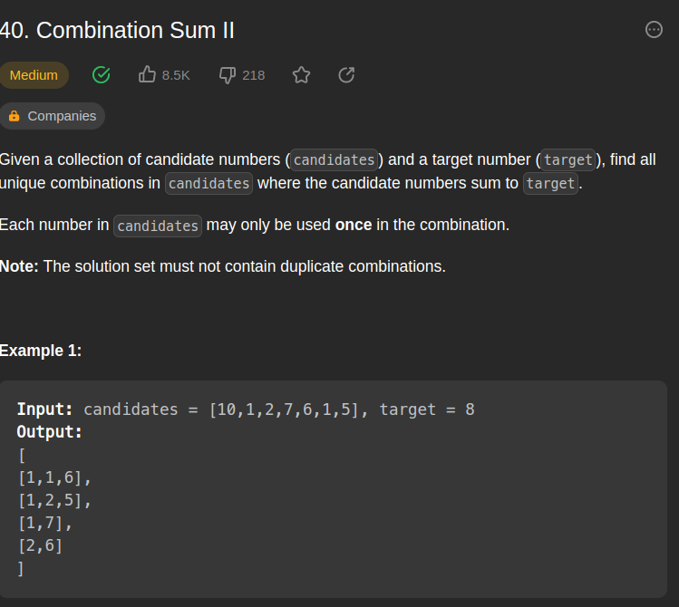
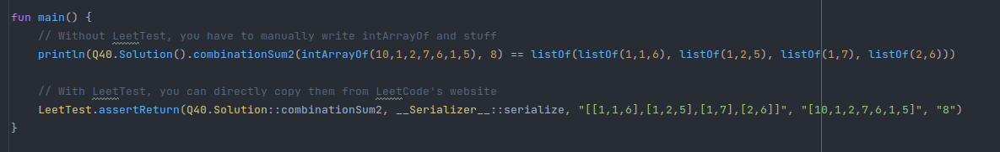

# 📝 fan87's DSA Solutions

A set of solutions coded by fan87 for Leetcode, Zerojudge, and other platforms.
It's here for the record, not for actual uses

## Features

### LeetTest Library/Framework
A LeetCode testing library made by fan87 is included in this repository, which
helps shortening your automation LeetCode tests from `intArrayOf`, parsing
TreeNode & ListNode manually and such. By making use of LeetCode's
official serialization library, you can directly copy the test cases from
LeetCode, enter the expected value, and be able to use debugger for
the same test cases.

## Legal
### Leetcode stdlib
I have included the extracted java Leetcode standard library. If you are the 
copyright holder of this library, and would like to take this down, please
contact me via my email: `fan87.TW@gmail.com`